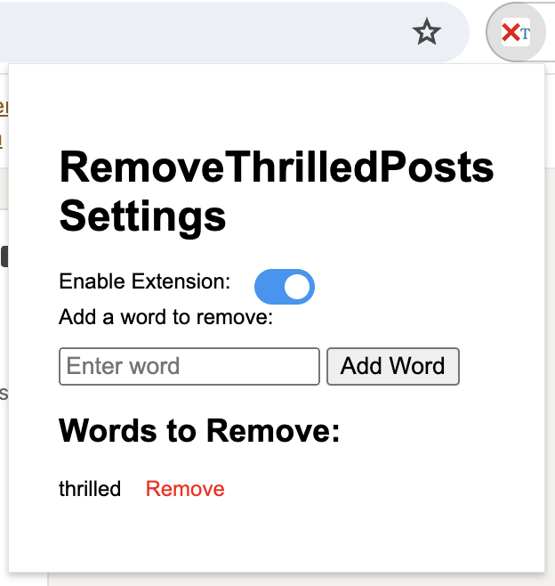

# Remove Thrilled LinkedIn Posts



**RemoveThrilledPosts** is a Chrome extension that removes LinkedIn posts containing the word "Thrilled."

## Features

- Automatically detects and removes LinkedIn posts that include the word "thrilled".
- Runs periodically to handle dynamically loaded content.
- Customizable the filtering with your own list.

## Installation

1. **Clone the repository** (or download the source code):
   ```bash
   git clone https://github.com/your-username/removethrilledposts.git
   ```

2. Navigate to the extension directory:
  cd linkedin-post-filter

3. Open Chrome and go to chrome://extensions/.

4. Enable Developer Mode by toggling the switch in the top right corner.

5. Click "Load unpacked" and select the directory where your manifest.json and content.js files are located.

The extension is now installed and will start filtering LinkedIn posts containing the word "thrilled".

## Usage

Navigate to LinkedIn and view your feed.
Posts containing "Thrilled" will be automatically removed.

## License
This project is licensed under the MIT License.
